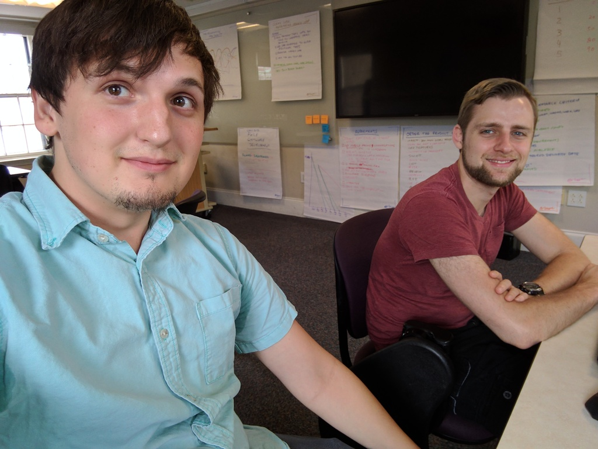
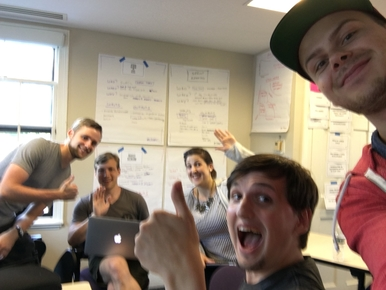
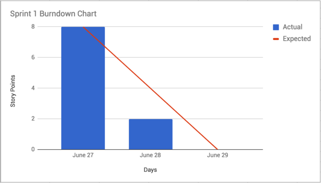

# Boston Scavenger

Project for CSCI S-71: Agile Software Development. A web application for finding food trucks in Boston.

## Table of Contents

- [Project Team](#project-team)
- [Product Design](#product-design)
- [Product Backlog](#product-backlog)
- [Sprint 1](#sprint-1)
- [Development](#development)

## Project Team

### Team Name

The Agile Connors

### Team Members

- Kerry Conley - *Product Owner*
- Kyle Maguire - *Scrum Master*
- Benjamin Jenkins - *Developer*
- Henry Chase - *Developer*
- Lennart Meincke - *Developer*

## Product Design

### Product Name

Boston Scavenger

### Far Vision

Demystify food trucks worldwide, enhancing the experience with some best practices from restaurants like: where and when to find them, how to get them to your neighborhood, and ordering ahead to earn points.

### Near Vision

Provide people local to Boston with up-to-date information about good, transient food sources nearby.

### Tag Line

*Sometimes your schedule makes finding food hard. If only there was a way you could find good, interesting food trucks close by... Soon you can with Boston Scavenger!*

### Stakeholders

- Local college students *(Danielle Alexandrine Madriaga)*
- Local working adults
- Food truck owners and operators

#### User Persona

<br />
**Name:** Danielle Alexandrine Madriaga<br />
**Age:** 19<br />
**Occupation:** Student<br />
**Interests:** Traveling, singing, eating<br />
**Description:** Danielle is a Harvard Summer School student and has class from 6:30 - 9:30 pm. Because Cabot Dining Hall dinner closes at 7:15 PM, she can never have dinner. Danielle also likes to eat local food at food trucks, but has trouble finding trucks nearby when her class is over.

## Product Backlog

The product backlog is maintained using Trello and is publicly accessible [here](https://trello.com/b/sfmmsg8h/agile-connors).

### Backlog Sizing

Backlog items were initially sized using relative mass valuation. Team members collaborated to order all existing backlog items from smallest to largest. These items were then organized into groups of similar size and story points were assigned based on these groups.

*Note: Only development team members participated in sizing backlog items.*

### Backlog Order

The rationale behind the initial ordering of the product backlog is primarily based on dependencies. The product has somewhat of a technical prerequisite in that it needs to display a geographic map and consume data from an existing API. Most of the product features depend on this base functionality existing.

Additionally, backlog items are generally prioritized higher if they are known to be more feasible. For example, product features that utilize data that definitely exists in the API we plan to use are prioritized higher.

Otherwise, features are examined for effort vs. impact and prioritized accordingly. This means that the implementation complexity is compared to how far the feature moves the product toward the product vision.

### Estimating Activity
We used affinity estimating to estimate our product backlog.

### Definition of Ready

- [ ] The backlog item has a **title**.
- [ ] The backlog item has a **user story sentence**.
- [ ] The backlog item has **one or more acceptance criteria**.
- [ ] The backlog item is **estimated in story points** and is **5 points or less**.
- [ ] The backlog item has any **additional details** needed to understand the requirements.

## Sprint 1

*Tuesday 6/27, 6:15pm - Thursday 6/29 3:00pm*

### Story Points Forecast

Our initial forecast is **8 story points**. These points comprise of:

- (2) View a map of Boston
- (3) View food trucks on the map
- (1) View truck title
- (1) View trucks available at current time
- (1) View truck availability

We chose 8 story points because the above seems like what we could realistically complete in 2 days while producing a stable product increment.

### Pair Programming
#### Henry and Ben tested and added functionality



### Daily Scrum



We conducted a daily scrum after the first day of our two day sprint. Each team member summarized what they accomplished in the last 24 hours, what they plan to accomplish in the next 24 hours, and if they are blocked by anything or need assistance from any other team members.

See below for a summary of this conversation.

- **Kyle**
  - *Last 24 hours:* Set up Github repository, front end and back end source code. Repo.
  - *Next 24 hours:* Work on assigned backlog item (first toggle controls). Compile and organize README content, ensure it meets requirements.
- **Lennart**
  - *Last 24 hours:* Add tooltip to trucks on map (includes title and placeholder hyperlink). Set up Slack integration for Github.
  - *Next 24 hours:* Work on assigned backlog item (view truck availability in tooltip).
- **Ben**
  - *Last 24 hours:* Add truck icon to map markers. Set up Travis CI integration with Github, tests run automatically. Set up Slack integration for Travis CI. Set up testing boilerplate. Refactor code for testability.
  - *Next 24 hours:* Review non-code parts of rubric and ensure completion. Write tests.
- **Henry**
  - *Last 24 hours:* Work on Trello board, populating stories. Pair programming with Ben :writing tests and refactoring.
  - *Next 24 hours:* More pair programming with Ben, create more tests.
- **Kerry**
  - *Last 24 hours:* Review backlog items. Buy pretzels.
  - *Next 24 hours:* Document impediment removal plan.

We discussed **impediments** at length and there turned out to be quite a few:

- Schedules, locations / distance
- Initial set up of environment
- Lack of experience with technology
- Testability (a lot of UI and not a lot of stored state)

Our **impediment removal** plan is as follows:

- Plan any meetings or collaborative sessions ahead of time (at least 24 hours in advance).
- Ensure every member of the team has a basic familiarity with the language and project.
- Use TDD when possible, and at least ensure tests are written as features are developed to ensure testability.
- If any other serious issues come up, we will meet as a team within 24 hours and find a solution.

### Sprint Review

#### Start doing
Write down tasks that come up as work is being done in our current card's task list. So we can track all completed work.
Come up with schedules before leaving class for the day. So we can decide when we'll sit down for pair programming.

#### Stop doing
Working on items aren't in the Sprint backlog. 
[(1) Provide link to truck website, if available on Agile Connors | Trello](https://trello.com/c/8DlYozJC/20-1-provide-link-to-truck-website-if-available)

#### Continue doing
Making Trello board to manage assignment guidelines.
[Agile Connors Meta | Trello](https://trello.com/b/pJo83OOM/agile-connors-meta)
Pair programming. Great learning experience.
Assigning card's to users in our group, so that we know whose main responsibilty completing a card is.

#### Kudos/shoutouts
Kyle quickly got the initial google maps api setup.
Ben did a lot to get the testing setup.
Lennart communicated with our stakeholder Danielle and recieved feedback from her. 

#### Burndown Chart

We completed our entire sprint backlog of 8 points by the end of the sprint. 6 points were completed on the first day. The final 2 points were completed on the second day.



## Development

Download and install [Node.js](https://nodejs.org/en/) if you don't already have it. This project was developed with Node v4.6.0. Any higher version should also work.

To set up the project and start the server, perform the following commands.

```sh
# Clone the repository.
git clone https://github.com/kylepixel/agile-connors.git

# Change directory.
cd agile-connors

# Install dependencies.
npm install

# Start the server.
npm start
```

Finally, open `localhost:3000` in a web browser.

## Resources
* Truck Icon made by [Nikita Golubev](http://www.flaticon.com/authors/nikita-golubev) from www.flaticon.com 