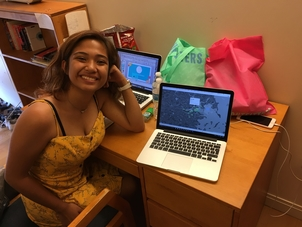
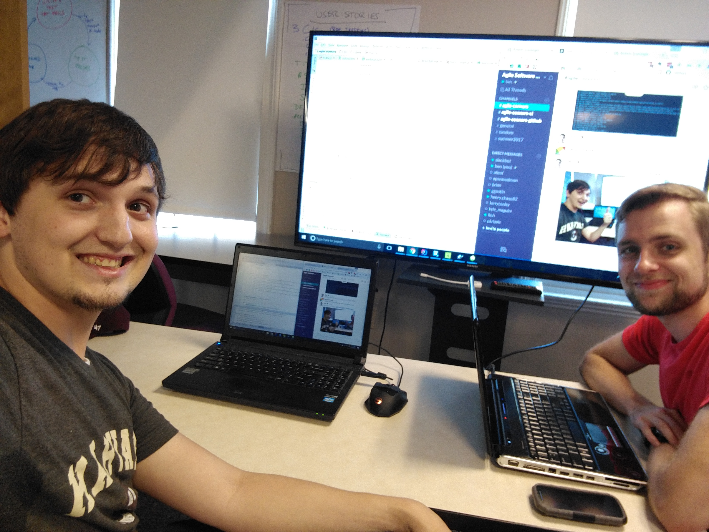
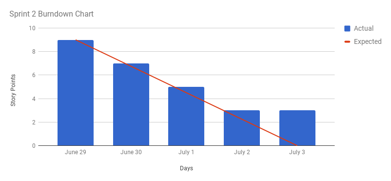
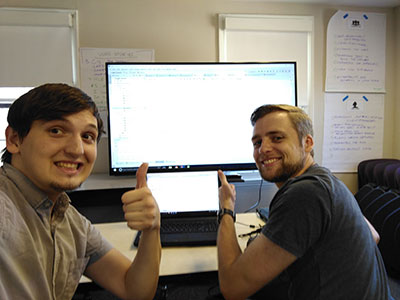
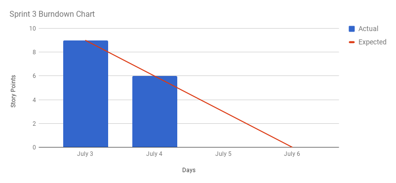
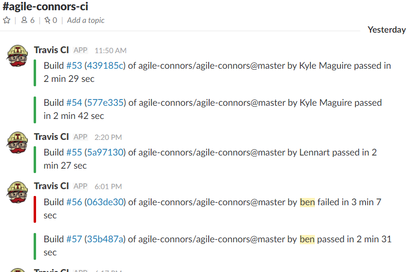
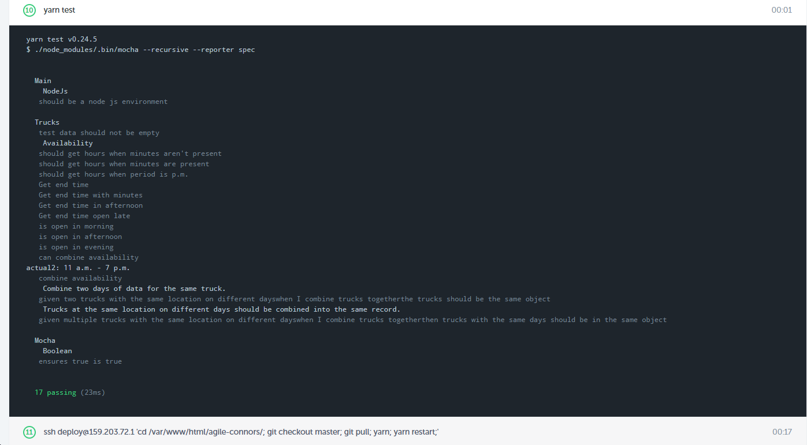
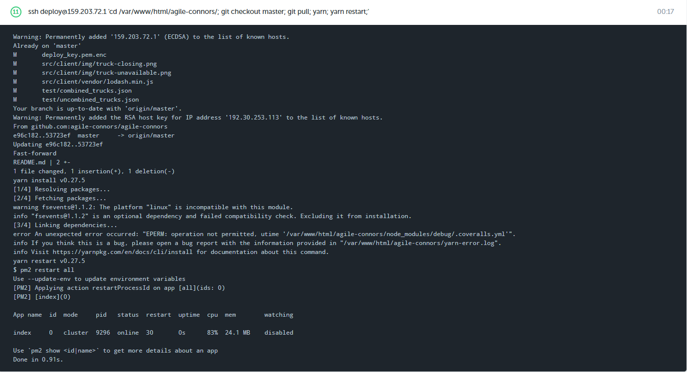

# Boston Scavenger

Project for CSCI S-71: Agile Software Development. A web application for finding food trucks in Boston.

## Table of Contents

- [Project Team](#project-team)
- [Product Design](#product-design)
- [Product Backlog](#product-backlog)
- [Sprint 1](#sprint-1)
- [Sprint 2](#sprint-2)
- [Sprint 3](#sprint-3)
- [Development](#development)

## Project Team

### Team Name

The Agile Connors

### Team Members

- Kerry Conley - *Product Owner*
- Kyle Maguire - *Scrum Master*
- Benjamin Jenkins - *Developer*
- Henry Chase - *Developer*
- Lennart Meincke - *Developer*

## Product Design

### Product Name

Boston Scavenger

### Far Vision

Demystify food trucks worldwide, enhancing the experience with some best practices from restaurants like: where and when to find them, how to get them to your neighborhood, and ordering ahead to earn points.

### Near Vision

Provide people local to Boston with up-to-date information about good, transient food sources nearby.

### Tag Line

*Sometimes your schedule makes finding food hard. If only there was a way you could find good, interesting food trucks close by... Soon you can with Boston Scavenger!*

### Stakeholders

- Local college students *(Danielle Alexandrine Madriaga)*
- Local working adults
- Food truck owners and operators

#### User Persona

<br />
**Name:** Danielle Alexandrine Madriaga<br />
**Age:** 19<br />
**Occupation:** Student<br />
**Interests:** Traveling, singing, eating<br />
**Description:** Danielle is a Harvard Summer School student and has class from 6:30 - 9:30 pm. Because Cabot Dining Hall dinner closes at 7:15 PM, she can never have dinner. Danielle also likes to eat local food at food trucks, but has trouble finding trucks nearby when her class is over.

## Product Backlog

The product backlog is maintained using Trello and is publicly accessible [here](https://trello.com/b/sfmmsg8h/agile-connors).

### Backlog Sizing

Backlog items were initially sized using relative mass valuation. Team members collaborated to order all existing backlog items from smallest to largest. These items were then organized into groups of similar size and story points were assigned based on these groups.

*Note: Only development team members participated in sizing backlog items.*

### Backlog Order

The rationale behind the initial ordering of the product backlog is primarily based on dependencies. The product has somewhat of a technical prerequisite in that it needs to display a geographic map and consume data from an existing API. Most of the product features depend on this base functionality existing.

Additionally, backlog items are generally prioritized higher if they are known to be more feasible. For example, product features that utilize data that definitely exists in the API we plan to use are prioritized higher.

Otherwise, features are examined for effort vs. impact and prioritized accordingly. This means that the implementation complexity is compared to how far the feature moves the product toward the product vision.

### Estimating Activity
We used affinity estimating to estimate our product backlog.

### Definition of Ready

- [ ] The backlog item has a **title**.
- [ ] The backlog item has a **user story sentence**.
- [ ] The backlog item has **one or more acceptance criteria**.
- [ ] The backlog item is **estimated in story points** and is **5 points or less**.
- [ ] The backlog item has any **additional details** needed to understand the requirements.

## Sprint 1

*Tuesday 6/27, 6:15pm - Thursday 6/29 3:00pm*

### Story Points Forecast

Our initial forecast is **8 story points**. These points comprise of:

- (2) View a map of Boston
- (3) View food trucks on the map
- (1) View truck title
- (1) View trucks available at current time
- (1) View truck availability

We chose 8 story points because the above seems like what we could realistically complete in 2 days while producing a stable product increment.

### Pair Programming
#### Henry and Ben tested and added functionality


### Daily Scrum


We conducted a daily scrum after the first day of our two day sprint. Each team member summarized what they accomplished in the last 24 hours, what they plan to accomplish in the next 24 hours, and if they are blocked by anything or need assistance from any other team members.

See below for a summary of this conversation.

- **Kyle**
  - *Last 24 hours:* Set up Github repository, front end and back end source code. Repo.
  - *Next 24 hours:* Work on assigned backlog item (first toggle controls). Compile and organize README content, ensure it meets requirements.
- **Lennart**
  - *Last 24 hours:* Add tooltip to trucks on map (includes title and placeholder hyperlink). Set up Slack integration for Github.
  - *Next 24 hours:* Work on assigned backlog item (view truck availability in tooltip).
- **Ben**
  - *Last 24 hours:* Add truck icon to map markers. Set up Travis CI integration with Github, tests run automatically. Set up Slack integration for Travis CI. Set up testing boilerplate. Refactor code for testability.
  - *Next 24 hours:* Review non-code parts of rubric and ensure completion. Write tests.
- **Henry**
  - *Last 24 hours:* Work on Trello board, populating stories. Pair programming with Ben :writing tests and refactoring.
  - *Next 24 hours:* More pair programming with Ben, create more tests.
- **Kerry**
  - *Last 24 hours:* Review backlog items. Buy pretzels.
  - *Next 24 hours:* Document impediment removal plan.

We discussed **impediments** at length and there turned out to be quite a few:

- Schedules, locations / distance
- Initial set up of environment
- Lack of experience with technology
- Testability (a lot of UI and not a lot of stored state)

Our **impediment removal** plan is as follows:

- Plan any meetings or collaborative sessions ahead of time (at least 24 hours in advance).
- Ensure every member of the team has a basic familiarity with the language and project.
- Use TDD when possible, and at least ensure tests are written as features are developed to ensure testability.
- If any other serious issues come up, we will meet as a team within 24 hours and find a solution.

### Sprint Review

We performed a sprint review and reviewed our backlog items and demoed new functionality to the rest of the team.

We also met with our real stakeholder and received their input on the project thus far. Picture below.

 

#### Burndown Chart

We completed our entire sprint backlog of 8 points by the end of the sprint. 6 points were completed on the first day. The final 2 points were completed on the second day.


### Sprint Retrospective

We did a sprint retrospective and used a foursquare activity where all team members are free to volunteer stickies for "start doing", "stop doing", "continue doing", and "shoutouts". The results are below.

**Start doing**

- Write down tasks that come up as work is being done in our current card's task list. So we can track all completed work.
- Come up with schedules before leaving class for the day. So we can decide when we'll sit down for pair programming.

**Stop doing**

- Working on items aren't in the Sprint backlog.

**Continue doing**

- Making Trello board to manage assignment guidelines ([Agile Connors Meta | Trello](https://trello.com/b/pJo83OOM/agile-connors-meta)).
- Pair programming. Great learning experience.
- Assigning card's to users in our group, so that we know whose main responsibilty completing a card is.

**Shout-outs**

- Kyle quickly got the initial google maps api setup.
- Ben did a lot to get the testing setup.
- Lennart communicated with our stakeholder Danielle and recieved feedback from her.

## Sprint 2

*Thursday 6/29, 6:15pm - Monday 7/3 3:00pm*

### Story Points Forecast

Our forecast for this sprint is **9 story points**. These points comprise of:

- (1) Provide link to truck website, if available
- (1) View truck availability at a glance
- (2) Filter by time of day
- (2) Filter by day of week
- (3) Filter by location

We chose 9 story points because we completed 8 story points last sprint and we have slightly more time this sprint as it spans more days (including a weekend). The 8 points felt very much appropriate, as we finished all of the work but probably couldn't have taken on any more. We are confident that we can add 2 more points to the velocity, given the schedule.

### Pair Programming

We utilized pair programming again this sprint. Henry and Ben met to work on tests.



### Daily Scrum

We conducted two daily scrums this sprint, the first on July 1st and the second on July 2nd. Each team member summarized what they accomplished in the last 24 hours, what they plan to accomplish in the next 24 hours, and if they are blocked by anything or need assistance from any other team members.

See below for a summary of this conversation.

*July 1*

- **Kyle**
  - *Last 24 hours:* Add initial content for the sprint to the README. Research changing truck icons for assigned backlog item.
  - *Next 24 hours:* Work on assigned backlog item.
- **Lennart**
  - *Last 24 hours:* Refactor and fix truck website showing in the info box. Remove ticket from sprint backlog that is no longer relevant.
  - *Next 24 hours:* Do more refactoring on these pieces.
- **Ben**
  - *Last 24 hours:* Add filtering for time of the day (morning, afternoon, evening).
  - *Next 24 hours:* Consolidate truck data so that a single truck title contains all data.
- **Henry**
  - *Last 24 hours:* Added HTML header bar for location search.
  - *Next 24 hours:* Implement location search.
- **Kerry**
  - *Last 24 hours:* Create icon suite and log of activities.
  - *Next 24 hours:* Thorough review of backlog.

*July 2*

- **Kyle**
  - *Last 24 hours:* Complete backlog item (view truck availability at a glance).
  - *Next 24 hours:* Refactor some of the work on the mentioned backlog item.
- **Lennart**
  - *Last 24 hours:* More refactoring of the truck data and info box.
  - *Next 24 hours:* Probably going to continue refactoring but there isn't much left.
- **Ben**
  - *Last 24 hours:* Sanitize truck data so that a single truck contains all of its days and availabilities. Also spent time combining availabilities when appropriate (i.e. if a truck has an 11 - 3 and a 3 - 8, they are combined to 11 - 8).
  - *Next 24 hours:* Add continuous deployment, and finish adding the ability to filter by days.
- **Henry**
  - *Last 24 hours:* Began implementing location search.
  - *Next 24 hours:* Continue implementing location search.
- **Kerry**
  - *Last 24 hours:* Update backlog logo card. Update backlog item status to be up-to-date. Review order of backlog items.
  - *Next 24 hours:* Continue to monitor backlog status and keep updated.

We discussed **impediments** again at each of the daily scrums and they remained roughly the same as the ones we identified in the first sprint's daily scrum.

### Sprint Review

We performed a sprint review and reviewed our backlog items and demoed new functionality to the rest of the team.

We once again showed the product to our **stakeholder** and they are happy with its progress so far. They like the updates to how availability is viewed on the info cards and on the truck icons on the map.

#### Burndown Chart

We didn't complete our entire sprint backlog of 9 points. We were not able to complete the search
 by location features, but we commented out the form elements so that we still have a releasable 
 product increment.



### Sprint Retrospective

We did a sprint retrospective and used the same foursquare activity as the previous sprint. All team members are free to volunteer stickies for "start doing", "stop doing", "continue doing", and "shoutouts". The results are below.

**Start doing**
- Discussing availability during sprint planning / when we'll be working on things (in case there are dependencies).

**Stop doing**
- Changing out sprint backlog items after the sprint starts, if we can avoid it.

**Continue doing**
- Doing great work on the product.

**Shout-outs**
- Ben, for taking on CI/CD plus a bunch of other work on the codebase.

## Sprint 3

*Monday 7/3, 6:15pm - Thursday 7/6 3:00pm*

### Story Points Forecast

Our forecast for this sprint is **9 story points**. These points comprise of:

- (3) Search bar
- (2) Brand site / improve appearance of map and icons
- (3) Filter by location
- (1) Filter by specific truck (company)

We chose 9 story points because we've assigned tasks to each team member and it seems like we can all realistically accomplish our individual tasks, which add up to 9 story points. We forecast 9 story points last sprint and only completed 6 but the remaining 3 points were represented by a single task that was almost finished and that is entering this sprint partially complete.

### Pair Programming

We utilized pair programming again this sprint. Henry and Ben worked on some functionality and associated tests.



### Daily Scrum

We conducted one daily scrum this sprint, after the first 48 hours of the sprint (24 of those hours covering the holiday of July 4). Each team member summarized what they accomplished in the last 24 hours, what they plan to accomplish in the next 24 hours, and if they are blocked by anything or need assistance from any other team members.

See below for a summary of this conversation.

- **Kyle**
  - *Last 24 hours:* Completed branding backlog item.
  - *Next 24 hours:* Assist with location search functionality. Write additional unit tests.
- **Lennart**
  - *Last 24 hours:* Begin work on search feature, along with tests for it.
  - *Next 24 hours:* Finalize work on search feature.
- **Ben**
  - *Last 24 hours:* Improve and stabilize Continuous Deployment. Refactor and clean up existing code. Complete "filter by specific truck" backlog item. Add autocomplete suggestions to search box.
  - *Next 24 hours:* Add tests and refactor code. Reorganize code into separate files based on their responsibilities.
- **Henry**
  - *Last 24 hours:* TODO
  - *Next 24 hours:* TODO
- **Kerry**
  - *Last 24 hours:* TODO
  - *Next 24 hours:* TODO

We discussed **impediments** again at this daily scrum. Once again, we identified distance and location as one of our biggest problem. It impedes our ability to collaborate but we've overcome it relatively well by being extremely active on Slack.

### Sprint Review

We performed an early sprint review, as we needed to prepare for the final presentation in which the official sprint review would take place. We reviewed our backlog items and demoed new functionality to the rest of the team.

#### Burndown Chart

We finished all of the tasks on our backlog half a day early. We spent the remaining time 
refactoring code instead of pulling more stories into the sprint.



### Sprint Retrospective

We did a sprint retrospective and used the foursquare activity once again. The results are below.

**Start doing**

- Pair programming more if we can make it work with peoples schedules.
- Actually using sprint retrospective results to improve the team.
- Doing more code review so that everyone has a good idea of changes to the codebase.

**Stop doing**

- Committing code to the master branch that doesn't pass tests.

**Continue doing**

- Maintaining the meta Trello board for tracking class-specific rubric requirements and their status.
- Assigning sprint backlog items (and meta backlog items) to one specific team member, to ensure someone is accountable for the item being completed.

**Shout-outs**

- Ben has done the bulk of the DevOps and unit testing work for the team.

## Development

Download and install [Node.js](https://nodejs.org/en/) if you don't already have it. This project was developed with Node v4.6.0. Any higher version should also work.

To set up the project and start the server, perform the following commands.

```sh
# Clone the repository.
git clone https://github.com/kylepixel/agile-connors.git

# Change directory.
cd agile-connors

# Install dependencies.
npm install

# Start the server.
npm start
```

Finally, open `localhost:3000` in a web browser.

### Continuous Integration / Continuous Deployment

We use Travis CI for continuous integration, because it easily integrates into our slack channel 
and tells us when we break a build.



We also use Codeship for Continuous Deployment, because it is the easiest way we could find to 
deploy a nodejs app. Since it allows us to easily ssh into our server.

#### All of our tests are ran before deploying


#### If they pass we deploy
We go through the process of updating the git repo, then restarting our node js app with yarn.




#### Deployed site
The deployed site can be found here: [Boston Scavenger](http://boston-scavenger.ben-jenkins.com/)

## Resources
* Truck Icon made by [Nikita Golubev](http://www.flaticon.com/authors/nikita-golubev) from www.flaticon.com
